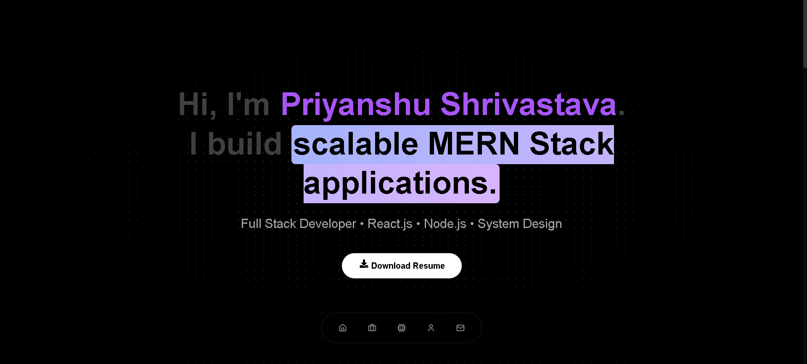

# 🚀 Priyanshu Shrivastava - Full Stack Developer Portfolio


A high-performance, interactive personal portfolio built with **React (Vite)**, **Tailwind CSS**, and **Framer Motion**. Designed to showcase full-stack MERN projects with a focus on modern UI/UX, smooth animations, and responsiveness.

🔗 **Live Demo:** [Insert Your Vercel Link Here]
## ✨ Key Features

- **⚡ Fast & Responsive:** Built with Vite for instant loading and fully responsive on all devices.
- **🎨 Cinematic UI:** Features a dark-mode aesthetic with grain textures, spotlight effects, and glowing gradients.
- **🧩 Bento Grid Layout:** unique, Apple-style grid layout to showcase featured projects.
- **🎞️ Smooth Animations:** Powered by **Framer Motion** for scroll reveals, hover effects, and transitions.
- **🛠️ Interactive Elements:**
  - **Floating Dock Navigation:** iOS-style floating menu.
  - **Velocity Scroll:** Infinite moving marquee for skills.
  - **Smart Contact:** Click-to-copy email interaction with direct mail redirect.
- **📄 Resume Download:** One-click access to the latest CV.

## 🛠️ Tech Stack

**Core:**


**Animations & UI:**
- **Framer Motion** (Complex animations)
- **Lucide React / React Icons** (Iconography)
- **Aceternity UI / Magic UI** (Advanced components)
- **Lenis** (Smooth scrolling engine)

## 📂 Projects Featured

| Project | Stack | Description |
| :--- | :--- | :--- |
| **The Petro Shop** | React, Node, MongoDB | Full-stack e-commerce with dynamic cart & payments. |
| **QuickNotes** | MERN Stack | Real-time notes app with CRUD & modern glassmorphism UI. |
| **EchoPulse CRM** | MERN, Analytics | Internal tool for HR/Admin management & RBAC. |
| **Digital Fly High** | React, Motion | Interactive corporate portfolio with advanced animations. |

## 🚀 Getting Started

To run this project locally on your machine:

1. **Clone the repository**
   ```bash
   git clone [https://github.com/Priyanshushrivastava15/portfolio.git](https://github.com/Priyanshushrivastava15/portfolio.git)
   cd portfolio
Install Dependencies

Bash

npm install
Run the Development Server

Bash

npm run dev
Open in Browser Visit http://localhost:5173 to see the site live.

📬 Contact
I am currently open to Freelance and Full-time Full Stack Developer roles.

Email: priyanshushrivastavaa@gmail.com

LinkedIn: Priyanshu Shrivastava

GitHub: @Priyanshushrivastava15

⭐ Star this repo if you like the design!
